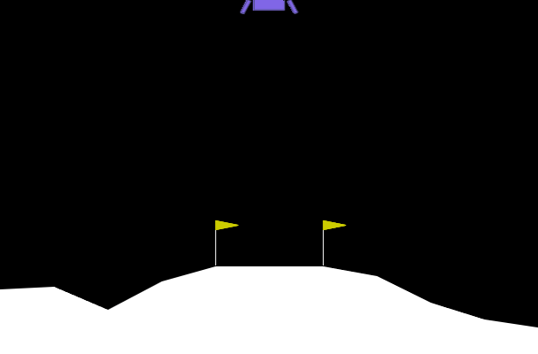

# Deep Q-Learning for Lunar Lander 🚀

This repository implements a Deep Q-Learning (DQN) agent to solve the Lunar Lander environment (`LunarLander-v3`) from OpenAI's `gymnasium`. The agent learns to successfully land the spacecraft by training a deep neural network using experience replay and Q-learning.

---

## Prerequisites

Before running the code, ensure that you have Python 3.8 or later installed along with the required packages. You can install dependencies using:

```bash
pip install -r requirements.txt
```

---

## Features

- **Custom Neural Network Architecture:** A feedforward network with two hidden layers to estimate Q-values.
- **Experience Replay:** A custom replay memory to store and sample past experiences.
- **Soft Target Updates:** For stabilized convergence during Q-learning.
- **Customizable Hyperparameters:** Easily tweak learning rate, batch size, epsilon decay, etc.
- **Visualization:** Save and display policy execution as a GIF.

---

## Training the Agent

The DQN agent trains on simulated episodes of the `LunarLander-v3` environment. **To train the agent**, simply run the notebook or script.

After training successfully, the model will save the weights to `checkpoint.pth`.

---

## Visualizing Results

Once training is complete, you can visualize the agent's actions by generating a GIF of the policy in action. The GIF is saved locally as `video.gif` and displayed in the notebook.



---

## Environment

The agent is trained on the `LunarLander-v3` environment, with customized parameters. You can also try this with the standard `LunarLander-v2` environment:

```python
env = gym.make("LunarLander-v2")
```

---

## Hyperparameters

You can tweak the main hyperparameters directly in the code, such as:

- **Learning Rate**: `5e-4`
- **Replay Buffer Size**: `1e5`
- **Batch Size**: `100`
- **Epsilon Decay**: `0.995`

Modify these parameters in the respective cells for experimentation.

---

## Dependencies

- Python 3.8+
- `gymnasium`: For the Lunar Lander environment.
- `torch`: For building and training the neural network.
- `numpy`: For numerical computation.
- `opencv-python`: For resizing frames while creating GIFs.
- `imageio`: For saving policy executions as GIFs.
- `ipython`: For displaying outputs in notebooks.

---

## Credits

This DQN implementation is adapted and customized for educational purposes, inspired by common reinforcement learning practices.

---